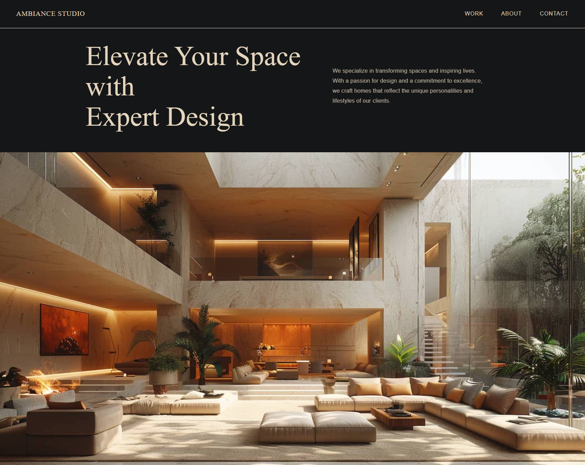
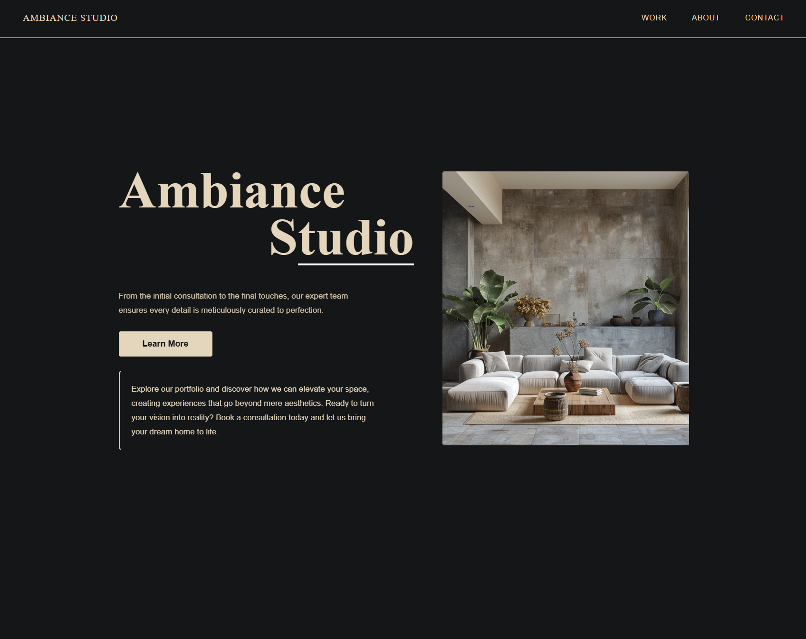
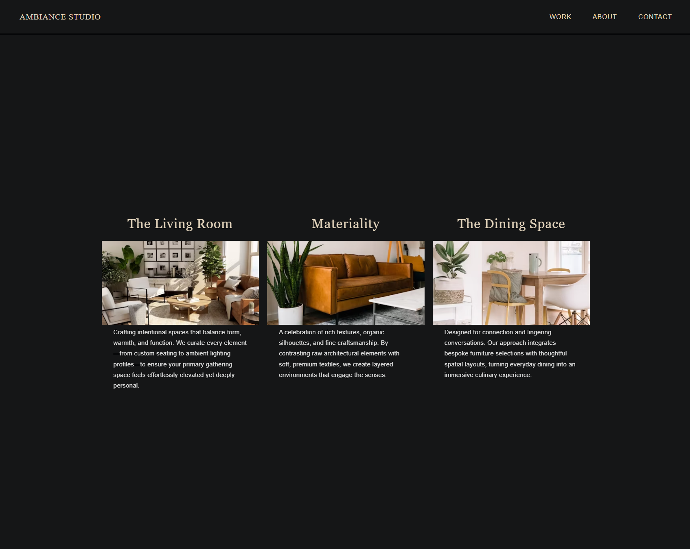
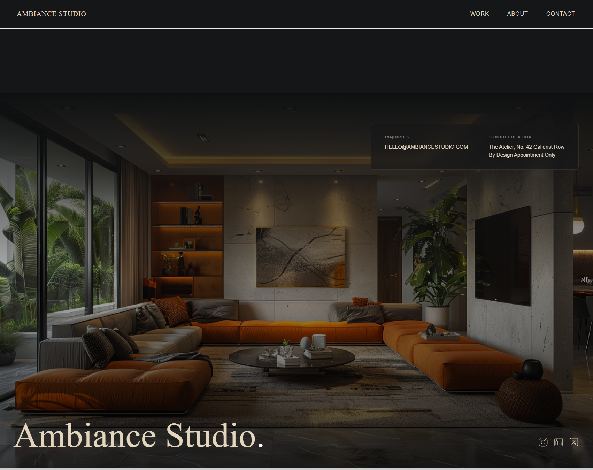

# Ambiance Studio
A modern, high-end agency website built to showcase interior design concepts. This project focuses on immersive UI/UX, responsive design, and smooth transitions.

([Live Demo](https://ambiancestudio.netlify.app/))

# 🚀 Key Features
Immersive Hero: Designed to capture user attention instantly with high-fidelity visuals.

Responsive Layout: Fully optimized for all device sizes, ensuring a seamless experience from mobile to desktop.

Modern Styling: Utilizes Sass for clean, modular CSS architecture and maintainable code.

Smooth UI/UX: Interactive panels and clean transitions for a premium "studio" feel.

# 🛠 Tech Stack
Frontend: React, Vite

Styling: Sass (SCSS)

Deployment: Netlify

Assets: Original design concepts created via Midjourney.

# Hero Section

# Studio Section

# Panel Section

# Footer Section

## Getting Started
1. Clone the repo: `git clone https://github.com/marzdevs/Ambiance-Studio.git`
2. Install dependencies: `npm install`
3. Run locally: `npm run dev`